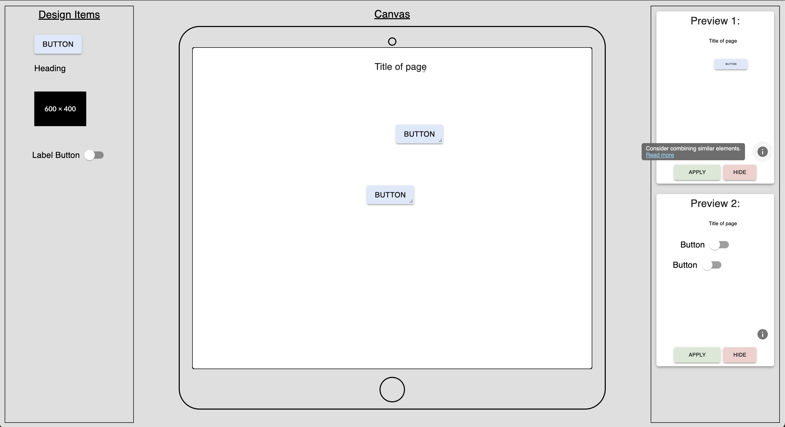

# UI Design Suggestion System Master Thesis

This repository contains the implementation of a system designed to improve the usability and aesthetics of user interfaces (UIs) by providing real-time design recommendations to non-technical users. The project explores methods of delivering these UI suggestions effectively through various approaches.

## Project Overview



The aim of this project is to bridge the gap between users' desire for UI personalization and their limited design expertise. It provides intuitive design suggestions to assist in enhancing the visual and functional quality of user interfaces. We implemented three main methods for presenting these suggestions:

- **Sidebar**: A panel that provides easy-to-access design recommendations alongside the canvas.
- **Chatbot**: An interactive assistant that offers design suggestions in a conversational format.
- **Tooltip**: Context-sensitive suggestions that appear directly adjacent to UI elements in need of improvement.

The project focuses on improving end-user development (EUD) tools by integrating these suggestion mechanisms, allowing users to create better UI designs with minimal technical knowledge.

## Technologies Used

- **React**: For building the user interface.
- **Material-UI**: For styling and implementing Material Design principles.
- **JavaScript**: Core logic for dynamic suggestions and UI interaction.
- **Jotai**: For state management.

## How It Works

The system dynamically analyses the user's design actions and provides suggestions based on predefined rules. These suggestions help users adjust text size, colour contrast, layout spacing, and other visual elements to adhere to established design guidelines.

## Key Features

- **Real-time Suggestions**: Recommendations are provided as the user works on the UI.
- **Customizable**: Users can apply or dismiss suggestions based on their preferences.
- **User-Centric Design**: Tailored for non-technical users seeking to improve their interface designs.

## Installation

1. Clone the repository:

   ```
   git clone https://github.com/erdoganabaci/design-suggestions.git
   ```

2. Navigate to the project directory and install dependencies:

   ```
   cd design-suggestions
   npm install
   ```

3. Start the development server:
   ```
   npm run dev
   ```

## Future Work

Further testing and enhancements are planned to refine the effectiveness of the suggestion system and expand its capabilities for different types of interfaces and devices.

## License

This project is licensed under the MIT License - see the [LICENSE](./LICENSE) file for details.
